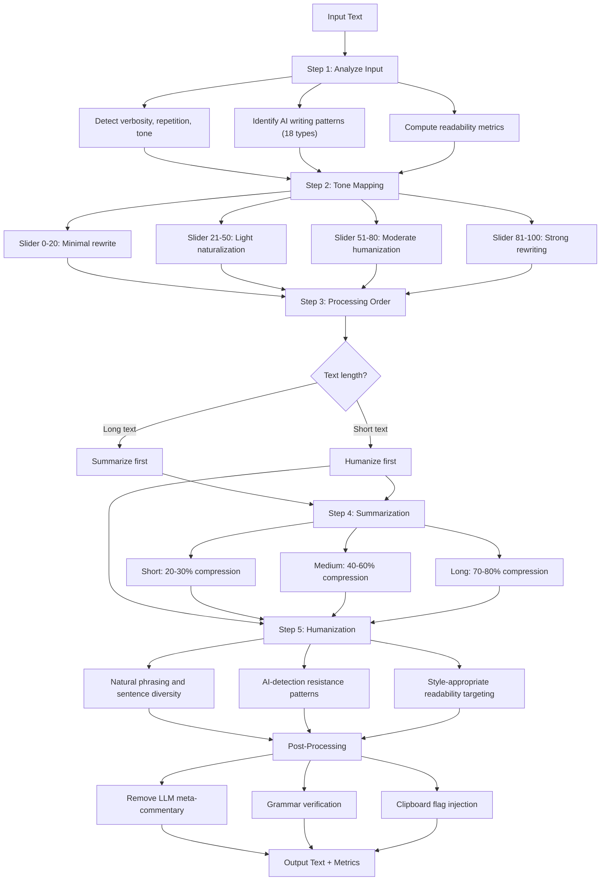

# NLP Transformation Engine

An advanced NLP text transformation application built with Streamlit and LangChain. It converts AI-generated text into natural, human-like writing through configurable pipelines for humanization, summarization, and readability optimization.

Live Demo - https://nlp-transformation-engine.streamlit.app/

## Features

- **Humanization** — Rewrites AI-generated text to sound naturally human-written with AI-detection resistance
- **Summarization** — Compresses text with configurable compression ratios (short/medium/long)
- **Combined Mode** — Runs both summarization and humanization in an intelligent pipeline order
- **Real-time Analysis** — Live word count, sentence analysis, AI pattern detection, and verbosity scoring
- **Readability Metrics** — Flesch-Kincaid Grade, Flesch Reading Ease, Gunning Fog Index
- **Style Adaptation** — Casual, Professional, Academic, and Concise writing styles
- **Clipboard Automation** — Auto-copy output with clipboard watcher mode
- **Processing History** — Tracks all transformations within a session

## Pipeline Architecture



## Project Structure

```
nlp-engine/
    app.py                  - Single-file application (engine + UI)
    requirements.txt        - Python dependencies
    .env                    - Local environment configuration
    .gitignore              - Git exclusion rules
    .streamlit/
        config.toml         - Streamlit theme and server config
        secrets.toml        - Deployment secrets (not committed)
```

## Setup

### Prerequisites

- Python 3.9+
- A Groq API key (free at https://console.groq.com)

### Local Installation

```bash
git clone https://github.com/YOUR_USERNAME/nlp-engine.git
cd nlp-engine

python3 -m venv .venv
source .venv/bin/activate

pip install -r requirements.txt
```

### Configuration

Edit `.env` and add your Groq API key:

```
LLM_PROVIDER=groq
LLM_MODEL=llama-3.3-70b-versatile
GROQ_API_KEY=gsk_your_key_here
LLM_TEMPERATURE=0.3
LLM_MAX_TOKENS=4096
```

### Run

```bash
source .venv/bin/activate
streamlit run app.py
```

Open http://localhost:8501 in your browser.

## Deployment (Streamlit Community Cloud)

1. Push the repository to GitHub
2. Go to https://share.streamlit.io and sign in with GitHub
3. Click "New app" and select your repository
4. Set main file path to `app.py`
5. In Advanced settings, add your secrets:

```toml
GROQ_API_KEY = "gsk_your_key_here"
LLM_PROVIDER = "groq"
LLM_MODEL = "llama-3.3-70b-versatile"
LLM_TEMPERATURE = "0.3"
LLM_MAX_TOKENS = "4096"
```

6. Click Deploy

## Supported LLM Providers

| Provider | Environment Variable | Model Example |
|----------|---------------------|---------------|
| Groq (default) | GROQ_API_KEY | llama-3.3-70b-versatile |
| OpenAI | LLM_API_KEY | gpt-4o |
| Anthropic | LLM_API_KEY | claude-sonnet-4-20250514 |
| Google | LLM_API_KEY | gemini-1.5-pro |
| Mistral | LLM_API_KEY | mistral-large-latest |
| Together AI | LLM_API_KEY | meta-llama/Llama-3-70b-chat-hf |
| Ollama (local) | - | llama3.2:3b |

To switch providers, change `LLM_PROVIDER` in `.env` and install the corresponding LangChain package (e.g., `langchain-openai`, `langchain-anthropic`).

## AI Detection Resistance

The humanization pipeline actively avoids common AI writing patterns:

- Overused transition words (furthermore, moreover, in conclusion)
- Formulaic phrases (it is worth noting, it's important to note)
- Buzzwords (delve, leverage, robust, cutting-edge, paradigm, seamlessly)
- Repetitive sentence structures and predictable openings
- Uniform sentence length patterns

## Readability Targets by Style

| Style | Target Grade Level | Audience |
|-------|-------------------|----------|
| Casual | Grade 6-8 | General public |
| Professional | Grade 9-12 | Business / workplace |
| Academic | Grade 13+ | Higher education |
| Concise | Grade 8-11 | Technical / dense |

## License

MIT
